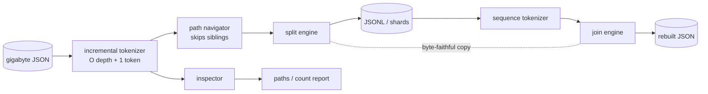

# jsonsaw

[English](README.md) | [中文](README.zh.md) | [日本語](README.ja.md)

[](LICENSE) [](go.mod) [](CHANGELOG.md)  [](CONTRIBUTING.md)

**jsonsaw：オープンソース・依存ゼロのストリーミング JSON のこぎり — ギガバイト級 JSON 配列を JSONL シャードに切り分け、バイト単位で同一のまま溶接し直す。jq が全体をメモリに読み込んで死ぬところを、一定メモリでやり切る。**


```bash
git clone https://github.com/JaydenCJ/jsonsaw && cd jsonsaw
go build -o jsonsaw ./cmd/jsonsaw    # single static binary, stdlib only
```

> プレリリース：v0.1.0 はまだどのパッケージレジストリにも公開されていません。上記の手順でソースからビルドしてください（Go ≥1.22 なら可）。

## なぜ jsonsaw？

API エクスポートは封筒に包まれた巨大配列 — `{"meta":…,"data":{"records":[…200 万行…]}}` — として届くのに、手近なツールはどれも全体を RAM に載せないと口をきいてくれない。`jq` は完全なドキュメントツリーを構築する：187 MB のエクスポートに `.data.records[]` を実行するだけでピーク 2.3 GB・86 秒かかり、5 GB のエクスポートでは OOM で殺される。`jq --stream` は生き残るが、すべての値を `[path, leaf]` イベント対に分解し、その再組み立てはユーザー任せ — パイプラインではなくパズルだ。間に合わせの Python スクリプトは通過中にデータを再エンコードし、`1e2` はこっそり `100.0` になってチェックサムが合わなくなる。jsonsaw は厳格なメモリ契約 — O(ネスト深さ + 最大単一トークン)、ファイルサイズに関係なく約 10 MiB で一定 — を持つインクリメンタルトークナイザーの上に構築され、封筒の奥の配列へ届く小さなパス言語（`data.records`、`results[0].rows`、`payload."weird.key"`）を備える。要素はトークン単位で reader から writer へ流れ、バイト単位で保存されるため、`split | join` の往復は `cmp` で完全一致する。そして `jsonsaw paths` は本当に知りたい質問 — *このファイルのどこに配列があるのか？* — に、何も読み込まずワンパスで先に答える。

| | jsonsaw | jq | jq --stream | Python + json |
|---|---|---|---|---|
| 187 MB / 200 万件エクスポートのピークメモリ | ✅ 10 MiB | ❌ 2,291 MiB | ✅ ~5 MiB | ❌ ~1.9 GiB |
| 同じエクスポートの所要時間 | ✅ 14 s | ⚠️ 86 s | ❌ 数分 | ⚠️ ~60 s |
| ネストしたパスで配列を抽出 | ✅ `--path data.records` | ✅ `.data.records[]` | ⚠️ イベントを手作業で再構成 | ⚠️ 手書きコード |
| 要素のバイト忠実性（`1e2` は `1e2` のまま） | ✅ 原文コピー | ❌ 再エンコード | ❌ 再エンコード | ❌ 再エンコード |
| JSONL を元の封筒構造へ再結合 | ✅ `join --path` | ⚠️ 全体を読み込む | ❌ | ⚠️ 手書きコード |
| N 件ごとのパートファイルに分割 | ✅ `--chunk` | ❌ | ❌ | ⚠️ 手書きコード |
| ランタイム依存 | 0（静的バイナリ 1 個） | libjq + libonig | libjq + libonig | Python ランタイム |

<sub>2026-07-13 計測、187,151,064 バイト・2,000,000 レコードのエクスポート：`jsonsaw split --path data.records` 10.0 MiB / 13.8 s に対し `jq -c '.data.records[]'` 2,291.5 MiB / 86.0 s（ピーク RSS は getrusage で取得）。jsonsaw は Go 標準ライブラリのみをインポートする。</sub>

## 特徴

- **一定メモリの保証** — すべてのサブコマンドが単一のインクリメンタルトークナイザーの上に載る。ピーク RSS は O(ネスト深さ + 最大単一トークン)：100 バイトのレコードも 100 MB のレコードもコストは同じで、50 GB のファイルも 50 MB と同じ約 10 MiB で済む。
- **ネストパス抽出** — `--path data.records`、`results[0].rows`、`payload."weird.key"`：ドットキー・角括弧インデックス・引用符付きセグメントで API 封筒の奥の配列へ届く。エラーは失敗した正確なプレフィックスを名指しする（`path data.users[5]: index 5 out of range (array has 3 elements)`）。
- **バイト単位で同一の往復** — 文字列エスケープと数値表記は原文のままコピーされ、再エンコードされない。`split | join` の出力はソースとの `cmp` に耐え、チェックサムが意味を持ち続ける。
- **まず構造を把握** — `jsonsaw paths` はワンパスで全パス・型・正確な要素数（`.data.records array[2000000]`）を報告し、`count` はこちら側で 1 バイトも JSON を解析せずに数を返す。
- **シャード前提の出力** — `--chunk 500000 --out shards` が並列ワーカー向けサイズの `part-00000.jsonl` 形式ファイルを書き出し、`join` は任意個のシャードを順序どおりに溶接、`--path` で再ネストも可能。
- **正直な失敗** — 厳格な RFC 8259、全エラーに `line N, col M` 付き、配列が閉じた後もドキュメント末尾を検証、文書化された終了コード（0/1/2/3）、悪意ある入力で状態が膨張しないよう 10,000 段のネスト上限。

## クイックスタート

```bash
# 1. where is the array in this export?
jsonsaw paths export.json
# 2. saw it into JSONL (line tools take it from here)
jsonsaw split --path data.records export.json > records.jsonl
# 3. weld it back into the envelope shape
jsonsaw join --path data.records records.jsonl > rebuilt.json
```

実際にキャプチャした出力：

```text
$ jsonsaw paths export.json
.              object{3}
.meta          object{2}
.meta.source   string
.meta.page     number
.data          object{1}
.data.records  array[4]
.cursor        null

$ jsonsaw split --path data.records export.json
{"id":1,"user":"user-0001","score":7.5,"active":false}
{"id":2,"user":"user-0002","score":14.25,"active":true}
{"id":3,"user":"user-0003","score":21.5,"active":false}
{"id":4,"user":"user-0004","score":28.125,"active":true}
jsonsaw split: 4 elements written
```

実エクスポートを並列処理向けにシャード化し、溶接結果を検証する：

```bash
jsonsaw split --path data.records --chunk 500000 --out shards export.json
# jsonsaw split: 2000000 elements written across 4 part files
jsonsaw join --path data.records shards/part-*.jsonl > rebuilt.json
jsonsaw split --path data.records --quiet rebuilt.json | cmp - records.jsonl
# byte-identical
```

## パス言語

パスはドキュメント内部の値を指す。同じ構文がすべてのサブコマンドで使える。完全な文法とメモリモデルは [docs/paths.md](docs/paths.md) を参照。

| 形式 | 例 | 意味 |
|---|---|---|
| 裸のキー | `data.records` | オブジェクトのキーを順に降りる |
| インデックス | `results[0].rows` | 配列要素、その後キーへ |
| ルートインデックス | `[0].items` | ドキュメントのルートが配列のとき |
| 引用符付きキー | `payload."weird.key"` | `.` `[` `]` `"` を含むキー名 |
| ルート | `.` または空 | トップレベル値そのもの |

裸の数字はオブジェクトのキー（`data.0` はキー `"0"`）。配列インデックスは常に `[N]` と書く。先頭のドットは許容されるので、`jsonsaw paths` の出力からコピーしたパスはそのまま使える。

## CLI リファレンス

`jsonsaw [split|join|count|paths|version] [flags] [FILE…]` — 入力は FILE または stdin。データは stdout、サマリーは stderr へ。終了コード：0 成功、1 不正な入力または解決不能なパス、2 使い方エラー、3 I/O エラー。

| フラグ | 既定値 | 効果 |
|---|---|---|
| `--path`（全部） | ルート | 分割/カウント対象の配列、または `join` 出力を包むキー |
| `--skip` / `--limit`（split） | 0 / 全件 | ウィンドウの切り出し。`--limit` は到達即読み取り停止 |
| `--chunk`（split） | オフ | パートファイルあたりの要素数。`--out DIR` が必要 |
| `--prefix`（split） | `part-` | パートファイル名のプレフィックス |
| `--out`（split/join） | stdout | 出力ファイル、`--chunk` 時はディレクトリ |
| `--pretty` / `--indent`（join） | オフ / 2 | 人間可読な出力 |
| `--depth`（paths） | 2 | 報告する深さ（それより深くてもカウントは正確） |
| `--format`（paths） | `text` | `text` か `json` |
| `--quiet`（split/join） | オフ | サマリー行を抑制 |

## 検証

このリポジトリは CI を同梱しない。上記の主張はすべてローカル実行で検証される：

```bash
go test ./...            # 91 deterministic tests, offline, < 5 s
bash scripts/smoke.sh    # end-to-end CLI check, prints SMOKE OK
```

## アーキテクチャ



## ロードマップ

- [x] v0.1.0 — 一定メモリのトークナイザー、ネストパス抽出、skip/limit/chunk 付き JSONL 分割、ラップ＆整形対応の複数シャード順序結合、paths/count による構造探索、91 テスト + スモークスクリプト
- [ ] `--gzip` — パートファイルと入力の透過圧縮
- [ ] `split --where key=value` — 切断中の述語プッシュダウン
- [ ] 中間 join なしの NDJSON→NDJSON 再チャンク（`resplit`）
- [ ] map-of-arrays 型エクスポート向けワイルドカードパス（`data.*.records`）
- [ ] Windows での `join shards\part-*.jsonl` パスグロブ対応

全リストは [open issues](https://github.com/JaydenCJ/jsonsaw/issues) を参照。

## コントリビュート

issue・ディスカッション・PR を歓迎します — ローカルの作業フロー（フォーマット、vet、テスト、`SMOKE OK`）は [CONTRIBUTING.md](CONTRIBUTING.md) を参照。入門タスクは [good first issue](https://github.com/JaydenCJ/jsonsaw/issues?q=is%3Aissue+is%3Aopen+label%3A%22good+first+issue%22) のラベル付き、設計の議論は [Discussions](https://github.com/JaydenCJ/jsonsaw/discussions) へ。

## ライセンス

[MIT](LICENSE)
