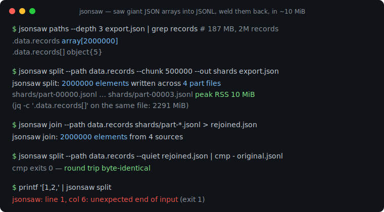
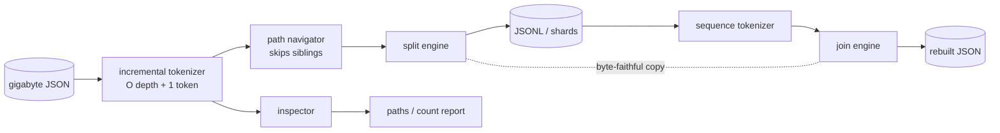

# jsonsaw

[English](README.md) | [中文](README.zh.md) | [日本語](README.ja.md)

[](LICENSE) [](go.mod) [](CHANGELOG.md)  [](CONTRIBUTING.md)

**jsonsaw：an open-source, zero-dependency streaming saw for gigabyte JSON arrays — split them into JSONL shards and weld them back, byte-identical, in constant memory where jq loads everything and dies.**



```bash
git clone https://github.com/JaydenCJ/jsonsaw && cd jsonsaw
go build -o jsonsaw ./cmd/jsonsaw    # single static binary, stdlib only
```

> Pre-release: v0.1.0 is not tagged on a package registry yet; build from source as above (any Go ≥1.22).

## Why jsonsaw?

API exports arrive as one giant array wrapped in an envelope — `{"meta":…,"data":{"records":[…2 million rows…]}}` — and every convenient tool wants the whole thing in RAM before it will talk to you. `jq` builds a full document tree: on a 187 MB export it peaks at 2.3 GB and takes 86 seconds just to run `.data.records[]`; on the 5 GB export it gets OOM-killed. `jq --stream` survives, but it explodes every value into `[path, leaf]` event pairs that you then reassemble by hand — a puzzle, not a pipeline. Ad-hoc Python scripts re-encode your data on the way through, so `1e2` silently becomes `100.0` and checksums stop matching. jsonsaw is built on one incremental tokenizer with a hard memory contract — O(nesting depth + largest single token), about 10 MiB flat regardless of file size — plus a small path language (`data.records`, `results[0].rows`, `payload."weird.key"`) to reach arrays buried in envelopes. Elements flow token-by-token from reader to writer, preserved byte-for-byte, so `split | join` round-trips are `cmp`-identical. And `jsonsaw paths` answers the question you actually have first: *where is the array in this thing?* — in one pass, without loading anything.

| | jsonsaw | jq | jq --stream | Python + json |
|---|---|---|---|---|
| Peak memory, 187 MB / 2M-record export | ✅ 10 MiB | ❌ 2,291 MiB | ✅ ~5 MiB | ❌ ~1.9 GiB |
| Wall time on that export | ✅ 14 s | ⚠️ 86 s | ❌ minutes | ⚠️ ~60 s |
| Extract array at a nested path | ✅ `--path data.records` | ✅ `.data.records[]` | ⚠️ reassemble events by hand | ⚠️ hand-written code |
| Byte-faithful elements (`1e2` stays `1e2`) | ✅ verbatim copy | ❌ re-encodes | ❌ re-encodes | ❌ re-encodes |
| Rejoin JSONL into the original envelope | ✅ `join --path` | ⚠️ loads everything | ❌ | ⚠️ hand-written code |
| Shard into N-record part files | ✅ `--chunk` | ❌ | ❌ | ⚠️ hand-written code |
| Runtime dependencies | 0 (one static binary) | libjq + libonig | libjq + libonig | Python runtime |

<sub>Measured 2026-07-13 on a 187,151,064-byte export with 2,000,000 records: `jsonsaw split --path data.records` 10.0 MiB / 13.8 s vs `jq -c '.data.records[]'` 2,291.5 MiB / 86.0 s (peak RSS via getrusage). jsonsaw imports the Go standard library only.</sub>

## Features

- **Constant memory, guaranteed** — one incremental tokenizer under every subcommand; peak RSS is O(nesting depth + largest single token), so a 100-byte record and a 100 MB record cost the same and a 50 GB file needs the same ~10 MiB as a 50 MB one.
- **Nested-path extraction** — `--path data.records`, `results[0].rows`, `payload."weird.key"`: dot keys, bracketed indexes, and quoted segments reach arrays buried in API envelopes; errors name the exact prefix that failed (`path data.users[5]: index 5 out of range (array has 3 elements)`).
- **Byte-identical round trips** — string escapes and number spellings are copied verbatim, never re-encoded; `split | join` output survives `cmp` against the source, so checksums keep meaning something.
- **Shape discovery first** — `jsonsaw paths` reports every path, type, and exact element count (`.data.records array[2000000]`) in one pass, and `count` gives you the number without a byte of JSON parsing on your side.
- **Shard-ready output** — `--chunk 500000 --out shards` writes `part-00000.jsonl`-style files sized for parallel workers; `join` welds any number of shards back, in order, optionally re-nesting them under `--path`.
- **Honest failure modes** — strict RFC 8259 with `line N, col M` on every error, whole-document tail validation after the array closes, documented exit codes (0/1/2/3), and a 10,000-level nesting cap so hostile inputs cannot balloon the state.

## Quickstart

```bash
# 1. where is the array in this export?
jsonsaw paths export.json
# 2. saw it into JSONL (line tools take it from here)
jsonsaw split --path data.records export.json > records.jsonl
# 3. weld it back into the envelope shape
jsonsaw join --path data.records records.jsonl > rebuilt.json
```

Real captured output:

```text
$ jsonsaw paths export.json
.              object{3}
.meta          object{2}
.meta.source   string
.meta.page     number
.data          object{1}
.data.records  array[4]
.cursor        null

$ jsonsaw split --path data.records export.json
{"id":1,"user":"user-0001","score":7.5,"active":false}
{"id":2,"user":"user-0002","score":14.25,"active":true}
{"id":3,"user":"user-0003","score":21.5,"active":false}
{"id":4,"user":"user-0004","score":28.125,"active":true}
jsonsaw split: 4 elements written
```

Sharding a real export for parallel processing, then proving the weld:

```bash
jsonsaw split --path data.records --chunk 500000 --out shards export.json
# jsonsaw split: 2000000 elements written across 4 part files
jsonsaw join --path data.records shards/part-*.jsonl > rebuilt.json
jsonsaw split --path data.records --quiet rebuilt.json | cmp - records.jsonl
# byte-identical
```

## Path language

Paths address a value inside the document; the same syntax works on every subcommand. Full grammar and the memory model: [docs/paths.md](docs/paths.md).

| Form | Example | Meaning |
|---|---|---|
| Bare keys | `data.records` | descend into object keys |
| Index | `results[0].rows` | array element, then key |
| Root index | `[0].items` | when the document root is an array |
| Quoted key | `payload."weird.key"` | keys containing `.` `[` `]` `"` |
| Root | `.` or empty | the top-level value itself |

Bare digits are object keys (`data.0` is the key `"0"`); array indexing is always `[N]`. A leading dot is tolerated, so paths pasted from `jsonsaw paths` output work unedited.

## CLI reference

`jsonsaw [split|join|count|paths|version] [flags] [FILE…]` — input from FILE or stdin; data on stdout, summaries on stderr. Exit codes: 0 ok, 1 invalid input or unresolvable path, 2 usage error, 3 I/O error.

| Flag | Default | Effect |
|---|---|---|
| `--path` (all) | root | the array to split/count, or the keys to wrap `join` output under |
| `--skip` / `--limit` (split) | 0 / all | carve a window; `--limit` stops reading immediately |
| `--chunk` (split) | off | elements per part file; requires `--out DIR` |
| `--prefix` (split) | `part-` | part file name prefix |
| `--out` (split/join) | stdout | output file, or directory with `--chunk` |
| `--pretty` / `--indent` (join) | off / 2 | human-readable output |
| `--depth` (paths) | 2 | how deep to report (counts stay exact below it) |
| `--format` (paths) | `text` | `text` or `json` |
| `--quiet` (split/join) | off | suppress the summary line |

## Verification

This repository ships no CI; every claim above is verified by local runs:

```bash
go test ./...            # 91 deterministic tests, offline, < 5 s
bash scripts/smoke.sh    # end-to-end CLI check, prints SMOKE OK
```

## Architecture



## Roadmap

- [x] v0.1.0 — constant-memory tokenizer, nested-path extraction, JSONL split with skip/limit/chunk, ordered multi-shard join with wrapping and pretty printing, paths/count shape discovery, 91 tests + smoke script
- [ ] `--gzip` — transparent compression on part files and inputs
- [ ] `split --where key=value` — predicate pushdown while sawing
- [ ] NDJSON-to-NDJSON re-chunking (`resplit`) without an intermediate join
- [ ] Wildcard paths (`data.*.records`) for map-of-arrays exports
- [ ] Windows path-glob niceties for `join shards\part-*.jsonl`

See the [open issues](https://github.com/JaydenCJ/jsonsaw/issues) for the full list.

## Contributing

Issues, discussions and pull requests are welcome — see [CONTRIBUTING.md](CONTRIBUTING.md) for the local workflow (format, vet, tests, `SMOKE OK`). Good entry points are labelled [good first issue](https://github.com/JaydenCJ/jsonsaw/issues?q=is%3Aissue+is%3Aopen+label%3A%22good+first+issue%22), and design questions live in [Discussions](https://github.com/JaydenCJ/jsonsaw/discussions).

## License

[MIT](LICENSE)
