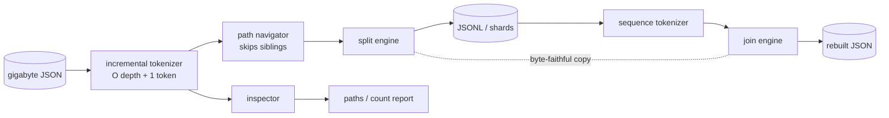

# jsonsaw

[English](README.md) | [中文](README.zh.md) | [日本語](README.ja.md)

[](LICENSE) [](go.mod) [](CHANGELOG.md)  [](CONTRIBUTING.md)

**jsonsaw：开源、零依赖的流式 JSON 锯 —— 把 GB 级 JSON 数组锯成 JSONL 分片再焊接回去，字节级一致、常量内存；而 jq 会把整个文件加载进内存然后死掉。**


```bash
git clone https://github.com/JaydenCJ/jsonsaw && cd jsonsaw
go build -o jsonsaw ./cmd/jsonsaw    # single static binary, stdlib only
```

> 预发布：v0.1.0 尚未发布到任何包注册表；请按上述方式从源码构建（任意 Go ≥1.22）。

## 为什么选 jsonsaw？

API 导出总是以一个套在信封里的巨型数组到达 —— `{"meta":…,"data":{"records":[…200 万行…]}}` —— 而每个顺手的工具都要求先把整个文件装进内存才肯开口。`jq` 会构建完整的文档树：对一个 187 MB 的导出文件，仅仅执行 `.data.records[]` 就要占用 2.3 GB 峰值内存、耗时 86 秒；换成 5 GB 的导出，它会被 OOM 杀掉。`jq --stream` 能活下来，但它把每个值炸成 `[path, leaf]` 事件对，还得你手工重组 —— 那是拼图，不是管道。临时写的 Python 脚本会在中途重新编码你的数据，`1e2` 悄悄变成 `100.0`，校验和从此对不上。jsonsaw 建立在一个带硬性内存契约的增量分词器之上 —— O(嵌套深度 + 最大单个 token)，无论文件多大都稳定在约 10 MiB —— 外加一门小巧的路径语言（`data.records`、`results[0].rows`、`payload."weird.key"`），直达埋在信封深处的数组。元素逐 token 从 reader 流向 writer，逐字节保留，因此 `split | join` 往返能通过 `cmp` 完全一致。而 `jsonsaw paths` 先回答你真正的问题：*数组到底在这个文件的哪里？* —— 一趟扫描，不加载任何东西。

| | jsonsaw | jq | jq --stream | Python + json |
|---|---|---|---|---|
| 187 MB / 200 万条导出的峰值内存 | ✅ 10 MiB | ❌ 2,291 MiB | ✅ ~5 MiB | ❌ ~1.9 GiB |
| 同一导出的耗时 | ✅ 14 s | ⚠️ 86 s | ❌ 数分钟 | ⚠️ ~60 s |
| 按嵌套路径提取数组 | ✅ `--path data.records` | ✅ `.data.records[]` | ⚠️ 手工重组事件 | ⚠️ 手写代码 |
| 元素字节级保真（`1e2` 保持 `1e2`） | ✅ 原样复制 | ❌ 重新编码 | ❌ 重新编码 | ❌ 重新编码 |
| 把 JSONL 焊回原信封结构 | ✅ `join --path` | ⚠️ 全量加载 | ❌ | ⚠️ 手写代码 |
| 按 N 条记录切分片文件 | ✅ `--chunk` | ❌ | ❌ | ⚠️ 手写代码 |
| 运行时依赖 | 0（单个静态二进制） | libjq + libonig | libjq + libonig | Python 运行时 |

<sub>2026-07-13 实测，187,151,064 字节、2,000,000 条记录的导出文件：`jsonsaw split --path data.records` 10.0 MiB / 13.8 s，对比 `jq -c '.data.records[]'` 2,291.5 MiB / 86.0 s（峰值 RSS 由 getrusage 测得）。jsonsaw 只导入 Go 标准库。</sub>

## 特性

- **常量内存，有保证** —— 所有子命令共用一个增量分词器；峰值 RSS 为 O(嵌套深度 + 最大单个 token)，100 字节的记录和 100 MB 的记录成本相同，50 GB 的文件和 50 MB 的一样只要约 10 MiB。
- **嵌套路径提取** —— `--path data.records`、`results[0].rows`、`payload."weird.key"`：点号键、方括号索引、带引号的段，直达埋在 API 信封里的数组；报错会指出失败的确切前缀（`path data.users[5]: index 5 out of range (array has 3 elements)`）。
- **字节级一致的往返** —— 字符串转义和数字写法原样复制、从不重新编码；`split | join` 的输出能与源文件通过 `cmp` 比对，校验和始终有意义。
- **先弄清结构** —— `jsonsaw paths` 一趟扫描报告每条路径、类型和精确元素数（`.data.records array[2000000]`）；`count` 直接给出数字，你这边一个字节的 JSON 都不用解析。
- **面向分片的输出** —— `--chunk 500000 --out shards` 写出 `part-00000.jsonl` 风格、按并行 worker 规格切好的文件；`join` 按顺序焊回任意数量的分片，并可用 `--path` 重新嵌套。
- **诚实的失败方式** —— 严格 RFC 8259，每个错误带 `line N, col M`；数组闭合后继续校验文档尾部；文档化的退出码（0/1/2/3）；10,000 层嵌套上限防止恶意输入撑爆状态。

## 快速上手

```bash
# 1. where is the array in this export?
jsonsaw paths export.json
# 2. saw it into JSONL (line tools take it from here)
jsonsaw split --path data.records export.json > records.jsonl
# 3. weld it back into the envelope shape
jsonsaw join --path data.records records.jsonl > rebuilt.json
```

真实捕获的输出：

```text
$ jsonsaw paths export.json
.              object{3}
.meta          object{2}
.meta.source   string
.meta.page     number
.data          object{1}
.data.records  array[4]
.cursor        null

$ jsonsaw split --path data.records export.json
{"id":1,"user":"user-0001","score":7.5,"active":false}
{"id":2,"user":"user-0002","score":14.25,"active":true}
{"id":3,"user":"user-0003","score":21.5,"active":false}
{"id":4,"user":"user-0004","score":28.125,"active":true}
jsonsaw split: 4 elements written
```

把真实导出切成分片做并行处理，再验证焊接结果：

```bash
jsonsaw split --path data.records --chunk 500000 --out shards export.json
# jsonsaw split: 2000000 elements written across 4 part files
jsonsaw join --path data.records shards/part-*.jsonl > rebuilt.json
jsonsaw split --path data.records --quiet rebuilt.json | cmp - records.jsonl
# byte-identical
```

## 路径语言

路径指向文档内部的某个值；同一套语法适用于所有子命令。完整语法与内存模型见 [docs/paths.md](docs/paths.md)。

| 形式 | 示例 | 含义 |
|---|---|---|
| 裸键 | `data.records` | 逐层进入对象键 |
| 索引 | `results[0].rows` | 数组元素，再进入键 |
| 根索引 | `[0].items` | 文档根本身是数组时 |
| 引号键 | `payload."weird.key"` | 键名含 `.` `[` `]` `"` |
| 根 | `.` 或留空 | 顶层值本身 |

裸数字是对象键（`data.0` 指键 `"0"`）；数组索引一律写 `[N]`。开头的点号会被容忍，从 `jsonsaw paths` 输出复制的路径无需修改即可使用。

## CLI 参考

`jsonsaw [split|join|count|paths|version] [flags] [FILE…]` —— 输入来自 FILE 或 stdin；数据走 stdout，摘要走 stderr。退出码：0 成功，1 输入无效或路径无法解析，2 用法错误，3 I/O 错误。

| 标志 | 默认值 | 作用 |
|---|---|---|
| `--path`（全部） | 根 | 要切分/计数的数组，或 `join` 输出要包裹的键 |
| `--skip` / `--limit`（split） | 0 / 全部 | 截取窗口；`--limit` 到数即停、不再读取 |
| `--chunk`（split） | 关 | 每个分片文件的元素数；需要 `--out DIR` |
| `--prefix`（split） | `part-` | 分片文件名前缀 |
| `--out`（split/join） | stdout | 输出文件，配合 `--chunk` 时为目录 |
| `--pretty` / `--indent`（join） | 关 / 2 | 人类可读的输出 |
| `--depth`（paths） | 2 | 报告深度（更深处的计数依然精确） |
| `--format`（paths） | `text` | `text` 或 `json` |
| `--quiet`（split/join） | 关 | 抑制摘要行 |

## 验证

本仓库不附带 CI；上面的每一条声明都由本地运行验证：

```bash
go test ./...            # 91 deterministic tests, offline, < 5 s
bash scripts/smoke.sh    # end-to-end CLI check, prints SMOKE OK
```

## 架构



## 路线图

- [x] v0.1.0 —— 常量内存分词器、嵌套路径提取、带 skip/limit/chunk 的 JSONL 切分、可包裹可美化的多分片有序焊接、paths/count 结构探查、91 个测试 + 冒烟脚本
- [ ] `--gzip` —— 分片文件与输入的透明压缩
- [ ] `split --where key=value` —— 锯切时的谓词下推
- [ ] NDJSON 到 NDJSON 的重新切片（`resplit`），无需中间 join
- [ ] 通配符路径（`data.*.records`），支持 map-of-arrays 型导出
- [ ] Windows 下 `join shards\part-*.jsonl` 的路径通配便利

完整列表见 [open issues](https://github.com/JaydenCJ/jsonsaw/issues)。

## 参与贡献

欢迎 issue、讨论和 PR —— 本地工作流（格式化、vet、测试、`SMOKE OK`）见 [CONTRIBUTING.md](CONTRIBUTING.md)。入门任务标为 [good first issue](https://github.com/JaydenCJ/jsonsaw/issues?q=is%3Aissue+is%3Aopen+label%3A%22good+first+issue%22)，设计讨论在 [Discussions](https://github.com/JaydenCJ/jsonsaw/discussions)。

## 许可证

[MIT](LICENSE)
